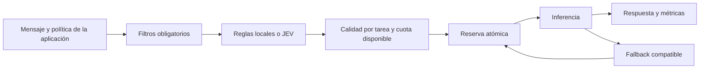

# Plan de selección inteligente de modelos en Relevo

Prioridad actual: implementar primero la alternativa Laya descrita en [PLAN_ROUTING_LAYA.md](PLAN_ROUTING_LAYA.md). Las referencias a JEV de este documento quedan como alternativa posterior.

Fecha: 2026-10-09. Alcance: revisión del código de la API e investigación de documentación primaria. La implementación Laya prioritaria está descrita en [PLAN_ROUTING_LAYA.md](PLAN_ROUTING_LAYA.md). Este documento conserva opciones para una etapa posterior; no se han ejecutado benchmarks de calidad ni llamadas a proveedores con credenciales del proyecto.

## 1. Recomendación

Construir un selector híbrido dentro de Relevo: filtros obligatorios → clasificación de tarea y dificultad → selección entre modelos evaluados → reserva de cuota → inferencia y fallback → registro de resultados. Laya es la primera implementación del clasificador; JEV puede evaluarse después como alternativa intercambiable. Una política local debe seguir funcionando cuando el servicio de clasificación falle o esté desactivado.

El objetivo medible es aumentar las respuestas aceptables por unidad de cuota gratuita, sujeto a un mínimo de calidad y a una latencia máxima. Con modelos de precio cero, el recurso escaso son solicitudes, tokens, capacidad y tiempo. La elección puede cambiar con cada solicitud y con el consumo disponible.

Separar dos decisiones: qué necesita la tarea y qué despliegue puede atenderla ahora. El clasificador interpreta el mensaje; el código calcula consumo, disponibilidad, puntuaciones y políticas. El catálogo describe capacidades; las evaluaciones propias acreditan calidad.

## 2. Qué hace hoy la API

La API pública usa `POST /v1/chat/completions`; el Playground llama al mismo `complete_with_fallback`. El selector filtra modelos habilitados, credenciales, contexto, capacidades y cooldown. Después aplica `priority` o `weighted_round_robin`. Reserva cuotas configuradas, prueba proveedores y registra la respuesta final. Esto proporciona una base reutilizable para la nueva selección.

Evidencia en el repositorio:

| Archivo | Hallazgo | Consecuencia |
| --- | --- | --- |
| `app/router/service.py:77` | `auto` ordena por `tier` y `priority`; no interpreta la tarea | Una traducción breve y una depuración compleja siguen el mismo orden si sus requisitos técnicos coinciden |
| `app/providers/catalog.py:19` | El tier inicial depende del proveedor | Groq/Cerebras reciben tier 1 con independencia del rendimiento del modelo; tier no equivale a potencia |
| `app/router/service.py:28` | Reparto ponderado dentro de cada tier | Cambia el turno, pero sigue favoreciendo primero todos los candidatos del tier más bajo |
| `app/providers/catalog.py:109` y `:208` | Detecta gratuidad, pero no la persiste en `Model` | No existe una política gratuita verificable para todo el catálogo; el filtro explícito de precios solo se aplica a OpenRouter/Kilo |
| `app/providers/catalog.py:208` | Los modelos descubiertos no reciben `ModelLimit` | Sin configuración manual, la reserva no limita su consumo local; el upstream sigue imponiendo sus límites |
| `app/router/quotas.py:129` | Suma reservas de tokens de todas las ventanas antes de ajustar cada una | Error de contabilidad: reservar 100 en minuto y día y consumir 80 produce delta -120; ambos contadores pueden quedar en -20 |
| `app/router/quotas.py` | Contadores por modelo; ventanas ancladas en UTC; neurons tratados como tokens | Faltan cuotas compartidas por cuenta/proyecto/IP, zonas de reinicio y unidades específicas de cada proveedor |
| `app/router/service.py:49` | Estima tokens con longitud de `str(content)` / 4 | El base64 de imágenes distorsiona la estimación; diferentes tokenizadores y límites de entrada/salida necesitan tratamiento propio |
| `app/providers/base.py` y `app/router/service.py:214` | El adaptador descarta el código/mensaje detallado de errores 400 | El fallback específico por exceso de contexto no puede reconocer esos errores en la ruta normal |
| `app/db/models.py:123` | Log por petición final, sin identidad completa del despliegue ni evaluación de calidad | HTTP 200 demuestra entrega técnica, no respuesta correcta; modelos con igual nombre pueden mezclarse en métricas |
| `app/db/models.py:119` | Existe `last_latency_ms`, pero el selector no lo actualiza | No permite ordenar por latencia observada |
| `app/api/routes.py:101` | Streaming público devuelve 501 | La integración con agentes requiere trabajo adicional de SSE y herramientas |

Otros puntos: el máximo de tres intentos puede agotarse con modelos del mismo proveedor antes de llegar a otro. La detección de JSON exige `json_object` y no cubre `json_schema`. Google rechaza tools/JSON en el selector porque el adaptador aún no los implementa. La detección de visión tampoco conserva toda la información específica de Gemini. El catálogo se refresca al listar modelos, no en cada completion ni mediante un ciclo periódico dedicado.

Estos hallazgos provienen de lectura del código. El ejemplo de conciliación es una consecuencia aritmética de la implementación; no una medición de consumo real del servicio.

## 3. Cómo integrar JEV

JEV es el modelo de decisiones de TypeSafe. Su API oficial es `POST https://api.typesafe.ai/v1/systemone`, con autenticación Bearer, `state`, `model` y preguntas tipadas. Permite Choice para categorías, Score para dificultad y Noul para decisiones binarias. No encaja en el adaptador actual de chat: debe existir un `TaskClassifier` independiente, invocado desde la selección. [Referencia oficial](https://docs.typesafe.ai/api).

La documentación actual indica `jev-1.13.0`, precio de US$0.042 por millón de tokens de entrada y salida gratuita. Solo acepta texto; 64k tokens por petición y 32k para estado más la pregunta más larga. La calidad en otros idiomas debe evaluarse: el inglés es su idioma principal. Fijar la versión para calibrar umbrales. [Modelos y condiciones](https://docs.typesafe.ai/models).

Ejemplo presupuestario, no consumo medido: 10.000 clasificaciones con 2.000 tokens facturables cada una representarían US$0.84 con esa tarifa. Los tokens incluyen los campos de evaluación, no solo el mensaje. La política `free_only` de inferencia no implica que el clasificador sea gratis: mantener presupuestos separados y un modo `classifier=local` de gasto externo cero.

Preguntas iniciales, en una sola llamada:

- `task`: conversación, resumen, traducción, extracción, programación, razonamiento, escritura u otra.
- `complexity`: sencilla, moderada o compleja, con criterios explícitos y casos límite.
- `needs_specialist`: cuando el dominio requiere un perfil específico.

Imágenes, presencia de tools, formato solicitado y longitud se detectan directamente en código. No enviar base64 a JEV. Para imágenes sin texto suficiente, seleccionar visión mediante reglas; si se necesita clasificar el contenido visual, eso requiere otro modelo y otro presupuesto.

Normalizar la clasificación a un objeto interno como este; no es la respuesta HTTP literal de JEV:

```json
{
  "task": "code_debugging",
  "complexity": "complex",
  "confidence": 0.87,
  "source": "jev",
  "classifier_version": "jev-1.13.0"
}
```

La confidence se deriva de la distribución de respuestas; no es la probabilidad de que el modelo generativo elegido responda correctamente. Calibrar por categoría y español. Si es baja, favorecer una política conservadora de calidad; evitar la degradación automática a un modelo débil por falta de certeza. [Confianza](https://docs.typesafe.ai/confidence).

Enviar el último mensaje relevante, instrucciones de tarea y contexto reciente necesario. Conservar texto de system/tool como datos claramente identificados; las políticas autorizadas pertenecen a la aplicación. Truncar por presupuesto de tokens y marcar el truncamiento. Evitar clasificar un «hazlo» aislado sin el contexto al que se refiere.

TypeSafe documenta sensibilidad al contexto irrelevante, contenido adversarial y orden de opciones; tampoco recomienda delegar cálculos exactos a JEV. Por eso cuotas, tiempos y fórmulas permanecen en código. Incorporar pruebas de permutación de opciones e instrucciones que intenten forzar el modelo más potente. [Limitaciones oficiales](https://docs.typesafe.ai/model-jaggedness/jev-1.13).

Timeout inicial propuesto de 1 segundo, configurable y sometido a medición local; no es una latencia garantizada. Presupuesto global de petición, concurrencia limitada, circuito propio y fallback local en 401/429/529/timeout o respuesta inválida. Ajustar/desactivar los reintentos por defecto del SDK para que no consuman el presupuesto de latencia. Una caída del clasificador no debe convertir un chat que puede atenderse en un 503.

## 4. Perfiles de modelos y selección dinámica

Usar perfiles «ligero», «equilibrado», «avanzado» y «especialista» para presentar el catálogo, junto con puntuaciones por tarea. Un modelo puede ser equilibrado en conversación y avanzado en código. El número de parámetros, popularidad y proveedor no bastan para declarar calidad.

Para el piloto, evaluar dos o tres candidatos por tarea que realmente estén habilitados y admitan acceso gratuito en la cuenta. La documentación de Groq lista `openai/gpt-oss-20b`, `openai/gpt-oss-120b` y `qwen/qwen3.8-27b`; son candidatos para comparar, no un ranking validado de Relevo. Usar el catálogo vivo y comprobar la cuenta antes de activarlos. [Groq: modelos y límites](https://console.groq.com/docs/rate-limits).

Guardar por despliegue:

- Calidad por tarea/idioma, tamaño de muestra, fecha y versión de evaluación.
- Capacidades comprobadas, contexto de entrada, salida máxima y compatibilidad real del adaptador.
- Acceso: gratuidad recurrente, crédito promocional, pago o desconocido; precio, fuente y fecha de verificación.
- Latencia p50/p95, tasa de errores, concurrencia, cuota restante y reinicio.
- Modelo base cuando se conoce, alias dinámico, proveedor real y política de datos.

La selección propuesta:

1. Aplicar filtros duros: modelo explícito, permisos de la clave, política de datos, gasto autorizado, contexto, modalidad, herramientas y formato.
2. Clasificar solo cuando la solicitud permita selección automática.
3. Exigir un mínimo de calidad por tarea y complejidad. Un perfil desconocido no recibe confianza plena automáticamente.
4. Puntuar los elegibles con calidad, fiabilidad, latencia, disponibilidad y coste de oportunidad de la cuota. Normalizar factores y versionar pesos; calibrarlos con evaluaciones.
5. Reservar cuota atómicamente justo antes de enviar. Si otra petición consumió el saldo, recalcular con candidatos restantes.
6. Preparar una lista de fallback compatible y con diversidad de proveedores; conservar la tarea y el mínimo de calidad. Revalidar disponibilidad en cada intento.

Pseudofórmula orientativa: utilidad = calidad esperada − penalización de latencia − riesgo de fallo − coste de consumir cuota escasa. Un filtro de calidad precede a la fórmula, para que una cuota abundante no compense una respuesta inadecuada. Sin candidatos que cumplan el mínimo, devolver falta de capacidad o degradar solo si la política lo autoriza explícitamente.



Un mensaje breve de traducción puede ir al modelo ligero si supera el mínimo; una depuración compleja se dirige al especialista validado; una imagen exige visión; una cuota próxima a agotarse desplaza tráfico sencillo hacia otro candidato adecuado. Cambiar el modelo no elimina el historial: se envía el contexto necesario y se mantiene afinidad durante una secuencia de herramientas.

## 5. Alternativas investigadas

| Alternativa | Utilidad para Relevo | Condición o coste | Prioridad |
| --- | --- | --- | --- |
| Reglas + perfiles medidos | Base transparente, rápida, sin clasificador externo | Menor capacidad para detectar tareas ambiguas; requiere mantenimiento | Primera entrega y fallback permanente |
| JEV | Categorías, dificultad y señales de incertidumbre | API de pago; evaluación propia en español | Piloto opcional tras corregir cuotas |
| Semantic Router | Clasificar intenciones mediante similitud de embeddings | Embeddings locales evitan coste API; no prueban por sí solos qué modelo responderá mejor | Comparación del piloto |
| RouteLLM | Estima cuándo conviene el modelo fuerte frente al débil | Diseño base de dos modelos; requiere recalibrar con nuestros pares y revisar costes de embeddings/checkpoints | Experimento posterior |
| Arch-Router 1.5B | Rutas por dominio y acción con preferencias configurables | Inferencia local y licencia específica `katanemo-research`; comprobar condiciones antes de adoptarlo | Opción local especializada |
| Clasificador local pequeño | Puede aprender tarea/dificultad con ejemplos revisados y correr sin cuota cloud | Necesita dataset y capacidad de inferencia; comparar calidad y latencia | Ruta completamente local |
| Bandit contextual | Aprende qué candidato funciona mejor con resultados reales | Requiere feedback fiable y exploración controlada; HTTP 200 no es una recompensa de calidad | Después de reunir evidencia |
| LiteLLM | Adaptadores, balanceo por uso/latencia y operaciones multiworker | Añade una capa y puede duplicar cuotas/circuitos de Relevo; no sustituye la evaluación por tarea | Considerar solo si crece la infraestructura |

Fuentes primarias: [Semantic Router](https://github.com/aurelio-labs/semantic-router), [RouteLLM](https://github.com/lm-sys/RouteLLM), [Arch-Router](https://huggingface.co/katanemo/Arch-Router-1.5B), [bandits de Vowpal Wabbit](https://vowpalwabbit.org/docs/vowpal_wabbit/python/latest/tutorials/python_Contextual_bandits_and_Vowpal_Wabbit.html), [LiteLLM](https://docs.litellm.ai/docs/routing).

No importar todos estos frameworks a la vez. Comparar clasificadores detrás del mismo contrato y conservar en Relevo la política de calidad/cuotas. Las cifras de ahorro de investigaciones externas no son una predicción para este catálogo gratuito.

## 6. Aprovechar mejor las cuotas gratuitas

Representar cuotas compartidas y las específicas del modelo de forma simultánea. Cambiar de modelo dentro del mismo proyecto o gateway no siempre aporta cuota adicional:

- Gemini aplica límites por proyecto y reinicia RPD a medianoche del Pacífico. Sus límites efectivos se consultan en AI Studio. [Documentación](https://ai.google.dev/gemini-api/docs/rate-limits).
- Kilo limita las rutas gratuitas a 200 solicitudes/hora por IP, tanto anónimas como autenticadas. Distintos modelos gratuitos del mismo gateway comparten ese presupuesto. [Uso y facturación](https://kilo.ai/docs/gateway/usage-and-billing).
- Cloudflare asigna 10.000 Neurons/día; no son tokens y hay modelos que requieren pago. [Precios](https://developers.cloudflare.com/workers-ai/platform/pricing/).
- OpenRouter publica 50 solicitudes/día para Free. `openrouter/free` elige aleatoriamente entre modelos gratuitos compatibles; sirve como reserva de disponibilidad, pero no acredita selección óptima por tarea. [Plan](https://openrouter.ai/pricing/), [router gratuito](https://openrouter.ai/openrouter/free/apps).

Conservar capacidad de los perfiles fuertes para tareas complejas; definir una reserva configurable y usarla según demanda y hora de reinicio. Evitar reservar siempre 1.024 tokens de salida para todas las tareas: usar límites por clase, siempre respetando el máximo explícito del cliente y contabilizando la salida real. Una respuesta demasiado corta puede provocar otro intento y consumir más cuota total.

Leer headers de cuota cuando el proveedor los publique, distinguir unidades/ventanas y reconciliar con consumo local. Groq expone saldo y reinicio de solicitudes diarias y tokens por minuto. El saldo externo es una señal, no una garantía de reserva: puede haber uso desde otras aplicaciones.

Añadir caché exacta de clasificación, aislada por cliente, con HMAC del contexto relevante y versiones de política/clasificador. La caché de respuestas será optativa y solo para tareas compatibles con reutilización; su clave incluye mensajes, parámetros, identidad y estado relevante. Excluir acciones de herramientas, información cambiante y contenido personalizado. No asumir que el prompt caching del upstream siempre evita RPM/RPD.

Una cascada ligero → validar → avanzado puede servir para extracción JSON y tareas verificables. Usar validadores de esquema, tests aislados de código o referencias conocidas; un juez LLM es señal auxiliar. Activarla por tarea, con máximo de escaladas y presupuesto total. No regenerar todas las respuestas con varios modelos: consumiría las cuotas más rápido.

Ollama puede proporcionar fallback independiente del cloud si el hardware responde con calidad y latencia suficientes. Tiene costes de equipo, electricidad y operación. Para colas de trabajos no interactivos, esperar al reinicio de cuota con un plazo máximo puede rendir mejor que forzar un modelo inferior.

## 7. Plan de implementación por entregas

Estimación inicial de esfuerzo de una persona familiarizada con el repositorio: 16–30 días efectivos para las primeras cinco entregas. Es orientativa, depende del acceso a proveedores, volumen de evaluaciones e incidencias; no es un compromiso de fecha.

| Entrega | Trabajo y archivos | Criterio de cierre | Esfuerzo orientativo |
| --- | --- | --- | --- |
| 1. Cuotas y elegibilidad | Corregir `quotas.py`, métricas por unidad y conciliación por contador; persistir gratuidad; capacidades efectivas y errores normalizados; mejorar estimación de contexto | Contabilidad sin negativos ni doble descuento; ningún destino de pago/desconocido entra en `free_only`; reservas concurrentes correctas en MySQL | 3–5 días |
| 2. Perfiles y evidencia | Migraciones, `ModelProfile`, medición por intento y despliegue; dataset español por tareas; catálogo con fuente/fecha y overrides manuales | Ranking reproducible por tarea; alias dinámicos identificados; resultados separados por proveedor/modelo/versión | 3–5 días |
| 3. Selector dinámico local | Separar elegibilidad, clasificación, ranking y ejecución; políticas por clave; diversidad de fallback y plazo global | `auto` usa tarea/cuota; modelo explícito conserva su elección; fallos no repiten un proveedor agotado | 3–6 días |
| 4. JEV y comparación | `TaskClassifier`, cliente JEV async, límites de concurrencia, presupuesto, timeout, caché y circuito; comparar con reglas/embeddings | JEV no es dependencia obligatoria; opciones y versión validadas; español, truncamiento y entradas adversariales cubiertos | 3–6 días |
| 5. Piloto observable | Modo sombra, endpoints administrativos de políticas/perfiles/explicación, panel de decisiones; despliegue gradual y rollback | Calidad no inferior al umbral pactado; latencia aceptable; mejora demostrada en cuota consumida por tarea aceptada | 4–8 días |
| 6. Aprendizaje y cascadas | Feedback fiable, evaluación offline del bandit, exploración limitada y validadores por tarea | Aprendizaje supera el baseline sin violar filtros/calidad; escaladas acotadas | Estimar con datos del piloto |

Backlog de estructuras propuestas:

- `app/router/eligibility.py`: requisitos verificables y restricciones de políticas.
- `app/router/classifiers/{base,rules,jev}.py`: contrato común y clasificaciones normalizadas.
- `app/router/ranking.py`: puntuaciones por tarea y disponibilidad.
- `app/router/policies.py`: umbrales, cuotas reservadas, degradación autorizada y versiones.
- `app/router/service.py`: orquestación, plazo global y ejecución con fallback.
- `app/providers/base.py`: resultado normalizado con usage, headers útiles, código seguro de error e identidad efectiva.
- `app/providers/catalog.py`: inventario separado de perfiles evaluados y overrides; refresco periódico fuera de la petición interactiva.
- `app/db/models.py` y migraciones: perfiles, políticas por clave, grupos de cuota, logs por intento y evaluación.

Extender el esquema con metadatos opcionales `relevo_routing`, retirados del payload antes de enviarlo al upstream. La política de la clave fija los máximos permitidos; el cliente solo puede pedir restricciones más estrictas. Mantener `model: "auto"` como punto de entrada y selección explícita para quien la necesita.

Endpoints propuestos: administración de políticas, perfiles y métricas de selección; `POST /admin/routing/preview` para ver clasificación/candidatos/motivos con simulación local por defecto. El preview no reserva cuota ni genera una respuesta; si llama al clasificador externo, debe indicarlo y contabilizar su uso. No exponerlo públicamente sin límites, pues podría consumir presupuesto de clasificación.

Registrar `request_id`, modelo/proveedor completos, tarea, confianza, versión de política, clasificador utilizado, motivo codificado, cuota, latencia y resultado de cada intento. Exponer explicación legible desde esos códigos. Mantener prompts y secretos fuera de logs por defecto; conservar muestras solo para evaluaciones autorizadas.

## 8. Evaluación y activación

Crear primero un conjunto de 200–500 ejemplos variados en español, separando ajuste y evaluación por conversación/origen. Es una propuesta de piloto, no una muestra que garantice significancia estadística. Ampliar las categorías con poca evidencia y reportar intervalos de incertidumbre. Evaluar candidatos con las mismas solicitudes, rúbricas y límites de salida; incluir costo de validación, clasificación y reintentos.

Comparar contra el selector actual y contra usar siempre el candidato de mayor calidad disponible. Métricas principales: calidad aceptada por tarea, consumo por tarea aceptada, solicitudes que quedan sin cuota, p95 de latencia y sobrecoste del clasificador. Métricas auxiliares: errores técnicos, degradaciones, proporción de perfiles y calibración de confianza. Un HTTP exitoso nunca sustituye la evaluación de calidad.

Pruebas de cierre: reservas minuto/día y concurrencia; reinicio por zona horaria; agotamiento compartido; 400 de contexto, 402, 429, 5xx y timeout; caída de JEV; cambio de catálogo; modelos desconocidos; tools/JSON/visión; mensajes breves dependientes de historial; prompt que intenta imponer un modelo; aislamiento de caché y gasto cero.

El modo sombra solo compara decisiones: no demuestra calidad contrafactual de modelos a los que no se llamó. Usar pruebas pareadas offline o un piloto acotado para medirla. Empezar con tráfico de bajo riesgo y despliegue 5% → 25% → 100% solo al cumplir criterios. Registrar probabilidad de elección si se introduce aprendizaje por bandit, para poder evaluar sesgos de selección.

Como objetivos iniciales negociables: calidad no más de 2 puntos porcentuales por debajo del baseline, reducción de cuota por respuesta aceptada y sobrecoste p95 de clasificación inferior a 1 segundo. Son metas a calibrar, no beneficios demostrados. Si no se logra ahorro o calidad, conservar el selector local y desactivar JEV por configuración.

Streaming y compatibilidad completa de herramientas deben tener su propia entrega si el destino son agentes: no cambiar de modelo en mitad de una respuesta SSE ni repetir una acción con efectos externos durante un fallback.

## 9. Decisión recomendada para comenzar

Iniciar con cuotas correctas, acceso gratuito comprobado, perfiles por tarea y un selector local dinámico. Integrar JEV detrás del mismo contrato y medirlo en paralelo. Adoptarlo cuando mejore la selección con un coste y una latencia aceptables. Introducir aprendizaje y cascadas cuando existan resultados de calidad fiables. Así Relevo aprovecha varios modelos gratuitos sin depender de una lista fija ni de una única API de clasificación.
